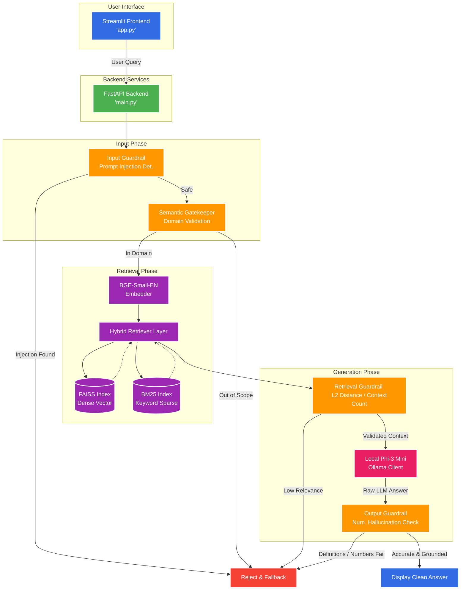

# Omnimart CX Assistant Architecture

Below is the complete system architecture diagram representing the flow of data through the deterministic guardrails, retrieval system, and local LLM.

## System Components

1. **Streamlit UI (`frontend/app.py`)**: The chat interface connecting users to the pipeline.
2. **FastAPI (`api/main.py`)**: The asynchronous backend engine routing queries.
3. **Deterministic Guardrails**:
   * *Input*: Blocks prompt injections and completely out-of-domain conversational requests.
   * *Retrieval*: Aborts request if the retrieved chunks are irrelevant (high L2 distance).
   * *Output*: Catches numerical hallucinations or leaked general knowledge before the user sees the answer!
4. **Hybrid Retrieval**: Queries both a Dense Vector DB (FAISS) and Sparse DB (BM25) for extreme recall precision.
5. **Local LLM (`src/llm/phi3_client.py`)**: Runs entirely locally via Ollama with strict `phi3` ChatML formatting boundaries to minimize pre-training leakages.
